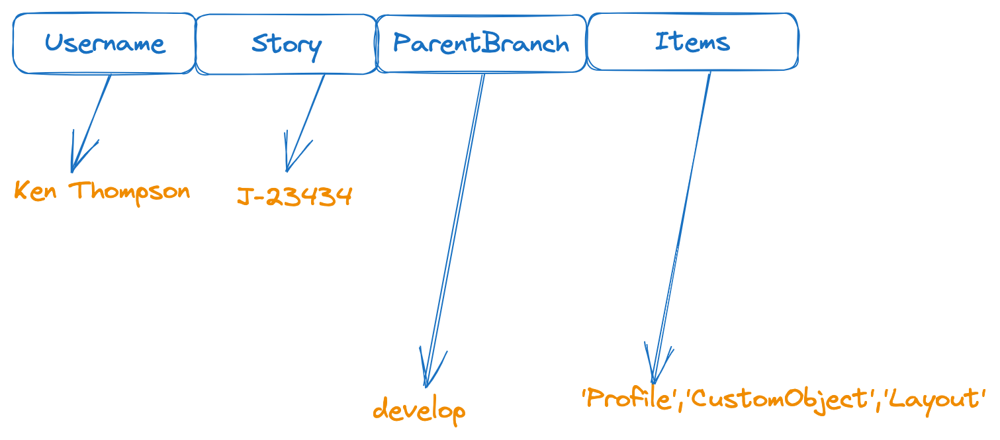

# Admin Changes - Demo with Scratch Org

## Create sfdx project
```bash
mkdir admin-tool-testing
cd admin-tool-testing
sf project create -n att
cd att

```

---

## Create Scratch Org:

```bash
sf org create scratch -f config/project-scratch-def.json -a att_sorg -v mohan.chinnappan.n.sel2@gmail.com
```

```
Creating Scratch Org... 
RequestId: 2SR3h000000Lx3vGAC (https://mohansun-ea-02-dev-ed.my.salesforce.com/2SR3h000000Lx3vGAC)
OrgId: 00D8K00000162Dm 
Username: test-sxwumcwgjo6z@example.com 
✓ Prepare Request
✓ Send Request
✓ Wait For Org
✓ Available
✓ Authenticate
✓ Deploy Settings
Done

Your scratch org is ready.

```

## Open the Scratch org
```bash
sf force org open -u test-sxwumcwgjo6z@example.com
```

## Input data


## Query the org for these changes

```sql
SELECT
Id,
LastModifiedBy.Name,
MemberIdOrName,
MemberType,
MemberName,
RevisionNum, RevisionCounter,
IsNameObsolete,
LastModifiedById,
IsNewMember,
ChangedBy
FROM SourceMember
WHERE LastModifiedBy.Name = 'User User‘
AND MemberType IN ('CustomField')
```

```
sf data query -f ./_my_sm.soql -o test-sxwumcwgjo6z@example.com -t -r csv 
```

```
Querying Data... done
```

## Make changes
- Create a picklist field Followup_type in the org manually
    - This simulates what the Admin users do

```bash
sf data query -f ./_my_sm.soql -o test-sxwumcwgjo6z@example.com -t -r csv 
```

```csv
Id,LastModifiedByName,MemberIdOrName,MemberType,MemberName,RevisionNum,RevisionCounter,IsNameObsolete,LastModifiedById,IsNewMember,ChangedBy
0MZ8K00000J6T5pWAF,User User,00N8K00000G5qVyUAJ,CustomField,Account.Followup_Type__c,1,1,false,0058K000003nTNDQA2,true,0058K000003nTND
0MZ8K00000J6TAaWAN,User User,00e8K000000rPL6QAM,Profile,Admin,6,6,false,0058K000003nTNDQA2,false,0058K000003nTND
0MZ8K00000J6T5qWAF,User User,00h8K000003Ktu5QAC,Layout,Account-Account (Marketing) Layout,2,2,false,0058K000003nTNDQA2,false,0058K000003nTND
0MZ8K00000J6T5rWAF,User User,00h8K000003Ktu6QAC,Layout,Account-Account (Sales) Layout,3,3,false,0058K000003nTNDQA2,false,0058K000003nTND
0MZ8K00000J6TAYWA3,User User,00h8K000003Ktu7QAC,Layout,Account-Account (Support) Layout,4,4,false,0058K000003nTNDQA2,false,0058K000003nTND
0MZ8K00000J6TAZWA3,User User,00h8K000003Ktu8QAC,Layout,Account-Account Layout,5,5,false,0058K000003nTNDQA2,false,0058K000003nTND
```

```Querying Data... done```

- Query for CustomField

```bash
sf data query -f ./_my_sm.soql -o test-sxwumcwgjo6z@example.com -t -r csv 
```
```csv
Id,LastModifiedByName,MemberIdOrName,MemberType,MemberName,RevisionNum,RevisionCounter,IsNameObsolete,LastModifiedById,IsNewMember,ChangedBy
0MZ8K00000J6T5pWAF,User User,00N8K00000G5qVyUAJ,CustomField,Account.Followup_Type__c,1,1,false,0058K000003nTNDQA2,true,0058K000003nTND
```

```
Querying Data... done
```
```bash
sf data query -f ./_my_sm.soql -o test-sxwumcwgjo6z@example.com -t -r csv | python tools/gen_packagexml.py 
```

```xml

<?xml version="1.0" encoding="UTF-8"?>
<Package xmlns="http://soap.sforce.com/2006/04/metadata">
  <version>58.0</version>
  <types>
    <members>Account.Followup_Type__c</members>
    <name>CustomField</name>
  </types>
  <types>
    <members>Admin</members>
    <name>Profile</name>
  </types>
  <types>
    <members>Account-Account Layout</members>
    <members>Account-Account (Marketing) Layout</members>
    <members>Account-Account (Sales) Layout</members>
    <members>Account-Account (Support) Layout</members>
    <name>Layout</name>
  </types>
</Package>
```

## Using 

``` bash
 sf project retrieve start -o test-sxwumcwgjo6z@example.com
```

```

Retrieving v59.0 metadata from test-sxwumcwgjo6z@example.com using the v60.0 SOAP API
Preparing retrieve request... Succeeded

Retrieved Source
==================================================================================================================================================
| State   Name                                   Type        Path                                                                                  
| ─────── ────────────────────────────────────── ─────────── ───────────────────────────────────────────────────────────────────────────────────── 
| Created Account.STTest__c                      CustomField force-app/main/default/objects/Account/fields/STTest__c.field-meta.xml                
| Changed Account-Account %28Marketing%29 Layout Layout      force-app/main/default/layouts/Account-Account %28Marketing%29 Layout.layout-meta.xml 
| Changed Account-Account %28Sales%29 Layout     Layout      force-app/main/default/layouts/Account-Account %28Sales%29 Layout.layout-meta.xml     
| Changed Account-Account %28Support%29 Layout   Layout      force-app/main/default/layouts/Account-Account %28Support%29 Layout.layout-meta.xml   
| Changed Account-Account Layout                 Layout      force-app/main/default/layouts/Account-Account Layout.layout-meta.xml                 
| Changed Admin                                  Profile     force-app/main/default/profiles/Admin.profile-meta.xml                        
```
-----

```bash
git status 
```

```
On branch main
Your branch is up to date with 'origin/main'.

Changes not staged for commit:
  (use "git add <file>..." to update what will be committed)
  (use "git restore <file>..." to discard changes in working directory)
	modified:   force-app/main/default/layouts/Account-Account %28Marketing%29 Layout.layout-meta.xml
	modified:   force-app/main/default/layouts/Account-Account %28Sales%29 Layout.layout-meta.xml
	modified:   force-app/main/default/layouts/Account-Account %28Support%29 Layout.layout-meta.xml
	modified:   force-app/main/default/layouts/Account-Account Layout.layout-meta.xml
	modified:   force-app/main/default/profiles/Admin.profile-meta.xml

Untracked files:
  (use "git add <file>..." to include in what will be committed)
	force-app/main/default/objects/Account/fields/STTest__c.field-meta.xml

```

- Now you can commit this into your branch - StoryNumber-xxx (that you cut from the develop)


### Content of maxRevision.json
```bash
cat .sf/orgs/00D8K00000162DmUAI/c.json
```


```json

{
    "serverMaxRevisionCounter": 12,
    "sourceMembers": {
        "CustomField__Account.Followup_Type__c": {
            "serverRevisionCounter": 1,
            "lastRetrievedFromServer": 1,
            "memberType": "CustomField",
            "isNameObsolete": false
        },
        "Profile__Admin": {
            "serverRevisionCounter": 12,
            "lastRetrievedFromServer": 12,
            "memberType": "Profile",
            "isNameObsolete": false
        },
        "Layout__Account-Account (Marketing) Layout": {
            "serverRevisionCounter": 8,
            "lastRetrievedFromServer": 8,
            "memberType": "Layout",
            "isNameObsolete": false
        },
        "Layout__Account-Account (Sales) Layout": {
            "serverRevisionCounter": 9,
            "lastRetrievedFromServer": 9,
            "memberType": "Layout",
            "isNameObsolete": false
        },
        "Layout__Account-Account (Support) Layout": {
            "serverRevisionCounter": 10,
            "lastRetrievedFromServer": 10,
            "memberType": "Layout",
            "isNameObsolete": false
        },
        "Layout__Account-Account Layout": {
            "serverRevisionCounter": 11,
            "lastRetrievedFromServer": 11,
            "memberType": "Layout",
            "isNameObsolete": false
        },
        "CustomField__Account.STTest__c": {
            "serverRevisionCounter": 7,
            "lastRetrievedFromServer": 7,
            "memberType": "CustomField",
            "isNameObsolete": false
        }
    }
}
```

```bash
sf force source status -o test-sxwumcwgjo6z@example.com
 ```
 ```
 STATE FULL NAME TYPE PROJECT PATH 
 ───────────────────────── ────────────────────────────────────── ─────────── ───────────────────────────────────────────────────────────────────────────────────── 
 Local Add (Conflict) Account.Followup_Type__c CustomField force-app/main/default/objects/Account/fields/Followup_Type__c.field-meta.xml 
 Local Add (Conflict) Account-Account %28Marketing%29 Layout Layout force-app/main/default/layouts/Account-Account %28Marketing%29 Layout.layout-meta.xml 
 Local Add (Conflict) Account-Account %28Sales%29 Layout Layout force-app/main/default/layouts/Account-Account %28Sales%29 Layout.layout-meta.xml 
 Local Add (Conflict) Account-Account %28Support%29 Layout Layout force-app/main/default/layouts/Account-Account %28Support%29 Layout.layout-meta.xml 
 Local Add (Conflict) Account-Account Layout Layout force-app/main/default/layouts/Account-Account Layout.layout-meta.xml 
 Local Add (Conflict) Admin Profile force-app/main/default/profiles/Admin.profile-meta.xml 
 Remote Changed (Conflict) Account.Followup_Type__c CustomField force-app/main/default/objects/Account/fields/Followup_Type__c.field-meta.xml 
 Remote Changed (Conflict) Account-Account (Marketing) Layout Layout force-app/main/default/layouts/Account-Account %28Marketing%29 Layout.layout-meta.xml 
 Remote Changed (Conflict) Account-Account (Sales) Layout Layout force-app/main/default/layouts/Account-Account %28Sales%29 Layout.layout-meta.xml 
 Remote Changed (Conflict) Account-Account (Support) Layout Layout force-app/main/default/layouts/Account-Account %28Support%29 Layout.layout-meta.xml 
 Remote Changed (Conflict) Account-Account Layout Layout force-app/main/default/layouts/Account-Account Layout.layout-meta.xml 
 Remote Changed (Conflict) Admin Profile force-app/main/default/profiles/Admin.profile-meta.xml 
```

## Source push

```bash
 sf force source push -o test-sxwumcwgjo6z@example.com -f
 ```
 ```
Pushing v59.0 metadata to test-sxwumcwgjo6z@example.com using the v60.0 SOAP API.
DEPLOY PROGRESS | ████████████████████████████████████████ | 6/6 Components
Updating source tracking... done
```

```bash
sf force source status -o test-sxwumcwgjo6z@example.com 
```
