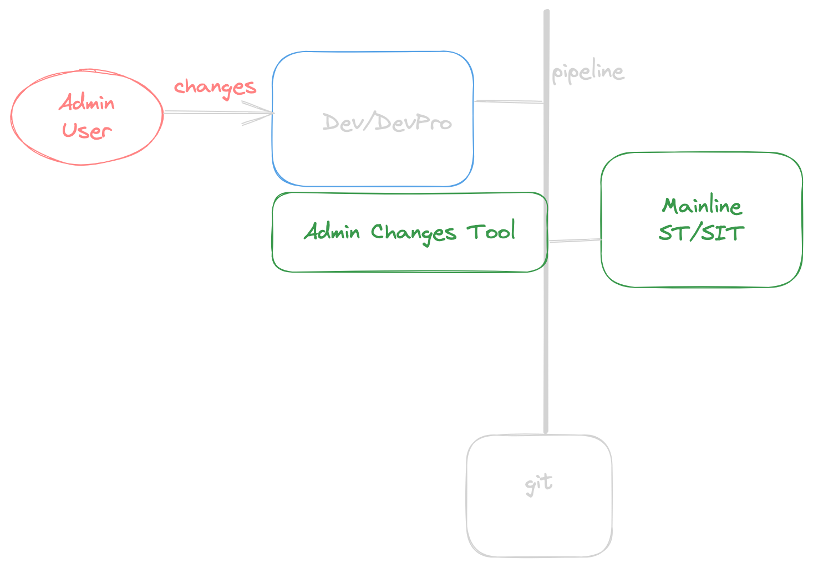

# Admin Changes - Demo with Scratch Org




## Create sfdx project (DevOps Setup)
```bash
mkdir admin-tool-testing
cd admin-tool-testing
sf project generate -n att
cd att

```

---

## Create Scratch Org (DevOps setup - it will be a Dev/DevPro Sandbox)

```bash
sf org create scratch -f config/project-scratch-def.json -a att_sorg3 -v mohan.chinnappan.n_ea2@gmail.com 

```

```
Creating Scratch Org... 
RequestId: 2SR3h000000Lx4UGAS (https://mohansun-ea-02-dev-ed.my.salesforce.com/2SR3h000000Lx4UGAS)
OrgId: 00D8B0000019u1n 
Username: test-6erewap1gcz8@example.com 
✓ Prepare Request
✓ Send Request
✓ Wait For Org
✓ Available
✓ Authenticate
✓ Deploy Settings
Done

Your scratch org is ready.

```

## Open the Scratch org (Admin will use this sandbox/scratchOrg)
```bash
sf force org open -u test-sxwumcwgjo6z@example.com
```

## Input data (DevOps will work with Admin to form this CSV file)


## Create a git branch StoryNumber-xxx  (Pipeline)
```bash
git branch StoryNumber-xxx

```

## Query the org for these changes (Pipeline will do this )

```sql
SELECT
Id,
LastModifiedBy.Name,
MemberIdOrName,
MemberType,
MemberName,
RevisionNum, RevisionCounter,
IsNameObsolete,
LastModifiedById,
IsNewMember,
ChangedBy
FROM SourceMember
WHERE LastModifiedBy.Name = 'User User'
AND MemberType IN ('CustomField')
```

```
sf data query -f ./_my_sm.soql -o test-sxwumcwgjo6z@example.com -t -r csv 
```

```
Querying Data... done
```

## Make changes (Admin User)
- Create a picklist field Followup_type in the org manually
    - This simulates what the Admin users do

### Pipeline performs this
```bash
sf data query -f ./_my_sm.soql -o test-sxwumcwgjo6z@example.com -t -r csv 
```

```csv
Id,LastModifiedByName,MemberIdOrName,MemberType,MemberName,RevisionNum,RevisionCounter,IsNameObsolete,LastModifiedById,IsNewMember,ChangedBy
0MZ8K00000J6T5pWAF,User User,00N8K00000G5qVyUAJ,CustomField,Account.Followup_Type__c,1,1,false,0058K000003nTNDQA2,true,0058K000003nTND
0MZ8K00000J6TAaWAN,User User,00e8K000000rPL6QAM,Profile,Admin,6,6,false,0058K000003nTNDQA2,false,0058K000003nTND
0MZ8K00000J6T5qWAF,User User,00h8K000003Ktu5QAC,Layout,Account-Account (Marketing) Layout,2,2,false,0058K000003nTNDQA2,false,0058K000003nTND
0MZ8K00000J6T5rWAF,User User,00h8K000003Ktu6QAC,Layout,Account-Account (Sales) Layout,3,3,false,0058K000003nTNDQA2,false,0058K000003nTND
0MZ8K00000J6TAYWA3,User User,00h8K000003Ktu7QAC,Layout,Account-Account (Support) Layout,4,4,false,0058K000003nTNDQA2,false,0058K000003nTND
0MZ8K00000J6TAZWA3,User User,00h8K000003Ktu8QAC,Layout,Account-Account Layout,5,5,false,0058K000003nTNDQA2,false,0058K000003nTND
```

```Querying Data... done```

- Query for CustomField

```bash
sf data query -f ./_my_sm.soql -o test-sxwumcwgjo6z@example.com -t -r csv 
```
```csv
Id,LastModifiedByName,MemberIdOrName,MemberType,MemberName,RevisionNum,RevisionCounter,IsNameObsolete,LastModifiedById,IsNewMember,ChangedBy
0MZ8K00000J6T5pWAF,User User,00N8K00000G5qVyUAJ,CustomField,Account.Followup_Type__c,1,1,false,0058K000003nTNDQA2,true,0058K000003nTND
```

```
Querying Data... done
```

## package.xml generation (Pipeline)
```bash
sf data query -f ./_my_sm.soql -o test-sxwumcwgjo6z@example.com -t -r csv | python tools/gen_packagexml.py 
```

```xml

<?xml version="1.0" encoding="UTF-8"?>
<Package xmlns="http://soap.sforce.com/2006/04/metadata">
  <version>58.0</version>
  <types>
    <members>Account.Followup_Type__c</members>
    <name>CustomField</name>
  </types>
  <types>
    <members>Admin</members>
    <name>Profile</name>
  </types>
  <types>
    <members>Account-Account Layout</members>
    <members>Account-Account (Marketing) Layout</members>
    <members>Account-Account (Sales) Layout</members>
    <members>Account-Account (Support) Layout</members>
    <name>Layout</name>
  </types>
</Package>
```


## Folder structure before the retrieve

```
tree                                                       
.
├── README.md
├── _my_sm.soql
├── config
│   └── project-scratch-def.json
├── force-app
│   └── main
│       └── default
│           ├── applications
│           ├── aura
│           ├── classes
│           ├── contentassets
│           ├── flexipages
│           ├── layouts
│           ├── lwc
│           ├── objects
│           ├── permissionsets
│           ├── staticresources
│           ├── tabs
│           └── triggers
├── jest.config.js
├── package.json
├── scripts
│   ├── apex
│   │   └── hello.apex
│   └── soql
│       └── account.soql
└── sfdx-project.json

19 directories, 8 files

```

## Retrieving changes and the created git branch   (Pipeline)

``` bash
 sf project retrieve start -o test-sxwumcwgjo6z@example.com
```

```

 ➜  att git:(StoryNumber-1234) ✗ sf project retrieve start -o att_sorg3
Retrieving v59.0 metadata from test-6erewap1gcz8@example.com using the v60.0 SOAP API
Preparing retrieve request... Succeeded

Retrieved Source
===================================================================================================================================================
| State   Name                                   Type         Path                                                                                  
| ─────── ────────────────────────────────────── ──────────── ───────────────────────────────────────────────────────────────────────────────────── 
| Created Account.GreenIndex__c                  CustomField  force-app/main/default/objects/Account/fields/GreenIndex__c.field-meta.xml            
| Created Account                                CustomObject force-app/main/default/objects/Account/Account.object-meta.xml                        
| Created Account-Account %28Marketing%29 Layout Layout       force-app/main/default/layouts/Account-Account %28Marketing%29 Layout.layout-meta.xml 
| Created Account-Account %28Sales%29 Layout     Layout       force-app/main/default/layouts/Account-Account %28Sales%29 Layout.layout-meta.xml     
| Created Account-Account %28Support%29 Layout   Layout       force-app/main/default/layouts/Account-Account %28Support%29 Layout.layout-meta.xml   
| Created Account-Account Layout                 Layout       force-app/main/default/layouts/Account-Account Layout.layout-meta.xml                 
| Created Admin                                  Profile      force-app/main/default/profiles/Admin.profile-meta.xml   
```
-----


## Folder structure after the retrieve

```
att git:(StoryNumber-1234) ✗ tree
.
├── README.md
├── _my_sm.soql
├── config
│   └── project-scratch-def.json
├── force-app
│   └── main
│       └── default
│           ├── applications
│           ├── aura
│           ├── classes
│           ├── contentassets
│           ├── flexipages
│           ├── layouts
│           │   ├── Account-Account\ %28Marketing%29\ Layout.layout-meta.xml
│           │   ├── Account-Account\ %28Sales%29\ Layout.layout-meta.xml
│           │   ├── Account-Account\ %28Support%29\ Layout.layout-meta.xml
│           │   └── Account-Account\ Layout.layout-meta.xml
│           ├── lwc
│           ├── objects
│           │   └── Account
│           │       ├── Account.object-meta.xml
│           │       └── fields
│           │           └── GreenIndex__c.field-meta.xml
│           ├── permissionsets
│           ├── profiles
│           │   └── Admin.profile-meta.xml
│           ├── staticresources
│           ├── tabs
│           └── triggers
├── jest.config.js
├── package.json
├── scripts
│   ├── apex
│   │   └── hello.apex
│   └── soql
│       └── account.soql
└── sfdx-project.json

22 directories, 15 files

```

## Git Operations (Pipeline)

```bash
git status 
```

```
➜  att git:(StoryNumber-1234) ✗ git status
On branch StoryNumber-1234
Untracked files:
  (use "git add <file>..." to include in what will be committed)
	_my_sm.soql
	force-app/main/default/layouts/
	force-app/main/default/objects/
	force-app/main/default/profiles/

nothing added to commit but untracked files present (use "git add" to track)

```


### Now you can commit this into your branch - StoryNumber-xxx (that you cut from the develop) (Pipeline)

```bash

git add -A
git commit -m 'StoryNumber-1234:Description'

git checkout main
git merge StoryNumber-1234

git push

```
----


### Content of maxRevision.json (Optional)
```bash
cat .sf/orgs/00D8K00000162DmUAI/c.json
```


```json

{
    "serverMaxRevisionCounter": 12,
    "sourceMembers": {
        "CustomField__Account.Followup_Type__c": {
            "serverRevisionCounter": 1,
            "lastRetrievedFromServer": 1,
            "memberType": "CustomField",
            "isNameObsolete": false
        },
        "Profile__Admin": {
            "serverRevisionCounter": 12,
            "lastRetrievedFromServer": 12,
            "memberType": "Profile",
            "isNameObsolete": false
        },
        "Layout__Account-Account (Marketing) Layout": {
            "serverRevisionCounter": 8,
            "lastRetrievedFromServer": 8,
            "memberType": "Layout",
            "isNameObsolete": false
        },
        "Layout__Account-Account (Sales) Layout": {
            "serverRevisionCounter": 9,
            "lastRetrievedFromServer": 9,
            "memberType": "Layout",
            "isNameObsolete": false
        },
        "Layout__Account-Account (Support) Layout": {
            "serverRevisionCounter": 10,
            "lastRetrievedFromServer": 10,
            "memberType": "Layout",
            "isNameObsolete": false
        },
        "Layout__Account-Account Layout": {
            "serverRevisionCounter": 11,
            "lastRetrievedFromServer": 11,
            "memberType": "Layout",
            "isNameObsolete": false
        },
        "CustomField__Account.STTest__c": {
            "serverRevisionCounter": 7,
            "lastRetrievedFromServer": 7,
            "memberType": "CustomField",
            "isNameObsolete": false
        }
    }
}
```
----

## Source status (Pipeline)

```bash
sf force source status -o test-sxwumcwgjo6z@example.com
 ```
 ```
 STATE FULL NAME TYPE PROJECT PATH 
 ───────────────────────── ────────────────────────────────────── ─────────── ───────────────────────────────────────────────────────────────────────────────────── 
 Local Add (Conflict) Account.Followup_Type__c CustomField force-app/main/default/objects/Account/fields/Followup_Type__c.field-meta.xml 
 Local Add (Conflict) Account-Account %28Marketing%29 Layout Layout force-app/main/default/layouts/Account-Account %28Marketing%29 Layout.layout-meta.xml 
 Local Add (Conflict) Account-Account %28Sales%29 Layout Layout force-app/main/default/layouts/Account-Account %28Sales%29 Layout.layout-meta.xml 
 Local Add (Conflict) Account-Account %28Support%29 Layout Layout force-app/main/default/layouts/Account-Account %28Support%29 Layout.layout-meta.xml 
 Local Add (Conflict) Account-Account Layout Layout force-app/main/default/layouts/Account-Account Layout.layout-meta.xml 
 Local Add (Conflict) Admin Profile force-app/main/default/profiles/Admin.profile-meta.xml 
 Remote Changed (Conflict) Account.Followup_Type__c CustomField force-app/main/default/objects/Account/fields/Followup_Type__c.field-meta.xml 
 Remote Changed (Conflict) Account-Account (Marketing) Layout Layout force-app/main/default/layouts/Account-Account %28Marketing%29 Layout.layout-meta.xml 
 Remote Changed (Conflict) Account-Account (Sales) Layout Layout force-app/main/default/layouts/Account-Account %28Sales%29 Layout.layout-meta.xml 
 Remote Changed (Conflict) Account-Account (Support) Layout Layout force-app/main/default/layouts/Account-Account %28Support%29 Layout.layout-meta.xml 
 Remote Changed (Conflict) Account-Account Layout Layout force-app/main/default/layouts/Account-Account Layout.layout-meta.xml 
 Remote Changed (Conflict) Admin Profile force-app/main/default/profiles/Admin.profile-meta.xml 
```

----

## Source push

```bash
 sf force source push -o test-sxwumcwgjo6z@example.com -f
 ```
 ```
Pushing v59.0 metadata to test-sxwumcwgjo6z@example.com using the v60.0 SOAP API.
DEPLOY PROGRESS | ████████████████████████████████████████ | 6/6 Components
Updating source tracking... done
```

```bash
sf force source status -o test-sxwumcwgjo6z@example.com 
```
## References
- [SF Project Commands](https://developer.salesforce.com/docs/atlas.en-us.sfdx_cli_reference.meta/sfdx_cli_reference/cli_reference_project_commands_unified.htm)
    - [project retrieve start](https://developer.salesforce.com/docs/atlas.en-us.sfdx_cli_reference.meta/sfdx_cli_reference/cli_reference_project_commands_unified.htm#cli_reference_project_retrieve_start_unified)
